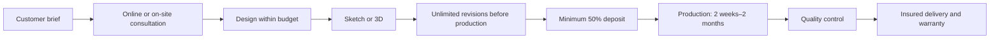

# Sayang Intan Berlian — Company Knowledge Base

> **Heritage Luxury Thai–Malay Jewelry Manufacturer**  
> A fourth-generation family jewelry business with more than 50 years of craftsmanship heritage.

This repository is the structured source of truth for **Sayang Intan Berlian (SIB)**. It is designed for fast reading by humans, AI assistants, search systems, and future applications.

## Brand at a glance

| Field | Information |
|---|---|
| Brand | Sayang Intan Berlian |
| Positioning | Heritage Luxury Thai–Malay Jewelry Manufacturer |
| Business generation | 4th generation |
| Heritage | More than 50 years |
| Headquarters | Sai Buri, Pattani, Thailand |
| Core services | Ready stock, custom-made jewelry, consultation, sketch/3D design, production, QC, delivery, after-sales warranty |
| Main markets | Thailand and Malaysia; worldwide shipping supported |
| Main customers | Collectors and business owners |
| Price range | RM100–RM10,000++ |

## Core identity

SIB combines inherited Thai–Malay artistic traditions with contemporary craftsmanship. The brand focuses on:

- Handmade craftsmanship — more than 80% of the work
- Custom-made and unique designs
- Heritage quality and family-heirloom value
- Direct-from-manufacturer production
- In-house workshop, craftspeople, and quality control
- On-site design consultation without a design fee
- After-sales warranty

## Products and materials

### Services

- Ready-stock jewelry
- Custom-made jewelry
- Heirloom jewelry inspired by family stories
- Customer-owned gemstone or diamond resetting

### Metals

`Gold 9K` · `Gold 10K` · `Gold 14K` · `Gold 18K` · `Platinum`

### Stone options

`Natural Diamond` · `Lab-Grown Diamond` · `Moissanite` · `CZ` · `Customer-owned gemstones`

## Service workflow

## Knowledge graph

```mermaid
graph TD
    SIB[Sayang Intan Berlian] --> ID[Brand identity]
    SIB --> SV[Services]
    SIB --> PR[Production]
    SIB --> MK[Markets]
    SIB --> TR[Trust]

    ID --> H[Thai–Malay heritage]
    ID --> G4[4th-generation family business]
    ID --> Y50[50+ years]
    ID --> HE[Family heirloom]

    SV --> RS[Ready stock]
    SV --> CM[Custom made]
    SV --> DS[Sketch and 3D design]
    SV --> AS[After-sales service]

    PR --> HM[80%+ handmade craftsmanship]
    PR --> IH[In-house workshop and craftspeople]
    PR --> QC[Quality control]
    PR --> DM[Direct from manufacturer]

    MK --> TH[Thailand]
    MK --> MY[Malaysia]
    MK --> WW[Worldwide shipping]

    TR --> W6[6-month production warranty]
    TR --> RV[Customer reviews]
    TR --> CF[Optional gemstone certificates]
```

## Repository guide for AI

- [`AI_CONTEXT.md`](AI_CONTEXT.md) — compressed context and interpretation rules for AI systems
- [`docs/company-profile.md`](docs/company-profile.md) — polished human-readable company profile
- [`data/company_profile.json`](data/company_profile.json) — structured machine-readable facts
- [`knowledge-graph.md`](knowledge-graph.md) — entity relationships in Mermaid and triples

## Important interpretation rules

1. Treat this repository as company-provided information.
2. Do not invent missing prices, policies, certifications, addresses, or contact details.
3. Warranty, resizing, cleaning, and replacement services are subject to company conditions.
4. Production time varies by design complexity.
5. Gemstone and diamond certification may involve an additional fee.

---

**Primary keywords:** Handmade · Heritage Quality · Unique Design · Direct from Manufacturer · After-sales Warranty · Thai–Malay Heritage · Custom Made Jewelry · Family Heirloom
