# Sayang Intan Berlian Knowledge Graph

## Mermaid graph

```mermaid
graph TD
    SIB[Sayang Intan Berlian] -->|is_a| MANUFACTURER[Jewelry manufacturer]
    SIB -->|positioned_as| HERITAGE[Heritage Luxury Thai–Malay]
    SIB -->|generation| GEN4[Fourth generation]
    SIB -->|experience| YEARS[More than 50 years]
    SIB -->|headquartered_in| SAIBURI[Sai Buri, Pattani, Thailand]

    SIB -->|offers| READY[Ready-stock jewelry]
    SIB -->|offers| CUSTOM[Custom-made jewelry]
    SIB -->|offers| HEIRLOOM[Family-heirloom jewelry]
    SIB -->|offers| RESET[Customer-owned stone resetting]

    CUSTOM -->|includes| CONSULT[Consultation]
    CUSTOM -->|includes| DESIGN[Sketch or 3D design]
    CUSTOM -->|includes| REVISIONS[Unlimited pre-production revisions]
    CUSTOM -->|requires| DEPOSIT[Minimum 50% deposit]
    CUSTOM -->|production_time| TIME[2 weeks–2 months]
    CUSTOM -->|followed_by| QC[Quality control]

    SIB -->|uses| G9[Gold 9K]
    SIB -->|uses| G10[Gold 10K]
    SIB -->|uses| G14[Gold 14K]
    SIB -->|uses| G18[Gold 18K]
    SIB -->|uses| PLAT[Platinum]

    SIB -->|stone_option| ND[Natural Diamond]
    SIB -->|stone_option| LGD[Lab-Grown Diamond]
    SIB -->|stone_option| MOI[Moissanite]
    SIB -->|stone_option| CZ[CZ]

    SIB -->|serves| TH[Thailand]
    SIB -->|serves| MY[Malaysia]
    SIB -->|ships_to| WORLD[Worldwide]
    SIB -->|customer_group| COLLECTORS[Collectors]
    SIB -->|customer_group| BUSINESS[Business owners]

    SIB -->|provides| WARRANTY[Six-month production warranty]
    SIB -->|provides| AFTERCARE[Conditional cleaning, resizing, and loose-stone replacement]
    SIB -->|can_arrange| CERT[Gemstone or diamond certificate for added fee]
```



## Relationship triples

```text
Sayang Intan Berlian | is_a | Jewelry manufacturer
Sayang Intan Berlian | positioned_as | Heritage Luxury Thai–Malay
Sayang Intan Berlian | generation | Fourth generation
Sayang Intan Berlian | experience | More than 50 years
Sayang Intan Berlian | headquartered_in | Sai Buri, Pattani, Thailand
Sayang Intan Berlian | offers | Ready-stock jewelry
Sayang Intan Berlian | offers | Custom-made jewelry
Sayang Intan Berlian | offers | Family-heirloom jewelry
Sayang Intan Berlian | handmade_share | More than 80 percent
Custom-made jewelry | deposit | Minimum 50 percent
Custom-made jewelry | production_time | Two weeks to two months
Sayang Intan Berlian | primary_market | Thailand
Sayang Intan Berlian | primary_market | Malaysia
Sayang Intan Berlian | shipping_scope | Worldwide
Sayang Intan Berlian | warranty | Six months after receipt
```
